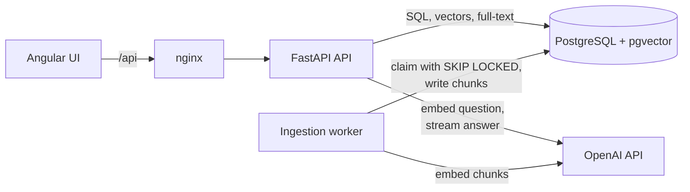

# Docs Q&A

A question-answering service over a team's own documents: upload PDFs and Markdown files, ask questions in plain language, and get answers that cite the exact file, page or heading, and passage they came from.

## Why I built it

Teams keep policies, runbooks and guides in files that nobody can search well. Keyword search fails as soon as the question uses different words from the document, and a general chatbot will happily make up a policy that does not exist.

Retrieval-Augmented Generation (RAG) fixes this by finding the relevant passages first and letting an LLM answer only from them. Getting it to work on a demo is easy; getting it to be trustworthy is not. I built this project to learn the parts that decide whether a RAG system can be trusted: how documents are chunked, why hybrid search beats pure vector search, how to make every claim traceable to a source, how to say "I don't know", and how to measure retrieval and answer quality instead of judging by eye. It also covers the backend work around it: a crash-safe ingestion queue in PostgreSQL, streaming responses, and a typed, tested Python codebase.

## Demo

Not recorded yet. A GIF of uploading the sample handbook and asking a question goes here.

## Features

- Collections of documents; upload PDF, Markdown and plain text files
- Background ingestion (parse, chunk, embed) with live status, failure reasons and retry
- Duplicate uploads detected by content hash; new versions replace old ones without a gap in search
- Hybrid search: vector similarity and PostgreSQL full-text search, merged with Reciprocal Rank Fusion
- Answers streamed token by token, with `[n]` citations that link to the source passage
- "Not in the documents" without calling the LLM when nothing relevant is found
- Every question stored with its sources, scores, token usage and latency; readers can rate answers
- An evaluation command that reports hit rate and MRR on a fixed question set, and optionally judges answer faithfulness
- API key authentication with reader and editor roles; errors as ProblemDetails

## Architecture



Four processes run from two images: the API and the worker share the backend image, nginx serves the Angular build and proxies `/api`. PostgreSQL holds everything (collections, documents, the uploaded files, chunks with their vectors and full-text index, questions), and its `documents` table is also the ingestion queue.

**Uploading a document.** `POST /api/collections/{id}/documents` checks the size and format, hashes the content, and inserts the document as `UPLOADED` with its bytes. It returns at once. The worker polls the table, claims the oldest waiting document with `SELECT ... FOR UPDATE SKIP LOCKED`, marks it `PROCESSING` with a lease, and commits. It then parses the file, splits it into chunks, and embeds them with OpenAI's embedding model. Finally, in one transaction, it re-checks its lease, inserts the chunks and marks the document `READY`.

**Asking a question.** `POST /api/collections/{id}/questions/stream` embeds the question, runs a vector search and a full-text search, merges them with RRF and keeps the top 6 chunks. If none is similar enough, it answers "not in the documents" without calling the LLM. Otherwise it sends the chunks as numbered sources to OpenAI and streams the answer back as Server-Sent Events: first the sources, then text deltas, then the saved question with its parsed citations.

## Tech stack

| Tool | Used for | Why this one | Alternatives considered |
|---|---|---|---|
| Python 3.13 | Backend | The RAG and evaluation ecosystem is Python-first; modern typing (`type` aliases, PEP 695 generics) with mypy strict | C#/.NET (my other projects; wanted to show breadth) |
| FastAPI | HTTP API, OpenAPI docs | Async, Pydantic validation at the boundary, dependency injection for wiring and test overrides | Litestar, Flask (sync) |
| SQLAlchemy 2 (async) + asyncpg | Persistence | Typed `Mapped[...]` models, explicit transactions, `with_for_update(skip_locked=True)` | Raw asyncpg (more boilerplate), SQLModel |
| Alembic | Migrations | Standard for SQLAlchemy; the HNSW and GIN indexes are written by hand in the migration | `create_all` (no history) |
| PostgreSQL 17 + pgvector 0.8 | Vectors, full-text search, data, queue | One database for everything; HNSW index and iterative scan for filtered vector search | Qdrant/Weaviate (another service to run and keep in sync), Elasticsearch |
| OpenAI `text-embedding-3-small` | Embeddings (1536 dimensions) | No model to host; strong retrieval quality; one provider and one key for the whole system | Ollama with nomic-embed-text (free and local, but another service and a model download; I used it first), sentence-transformers in-process (bigger image) |
| OpenAI Responses API (`gpt-5.4-mini`) | Answer generation | Cheap and fast for short grounded answers; streaming; `store=false` | Claude (my first plan; its native citation blocks would replace marker parsing), a local LLM via Ollama (weak answers on CPU) |
| pypdf | PDF text extraction | Pure Python, page-by-page text | PyMuPDF (AGPL license), unstructured (heavy) |
| pydantic-settings | Configuration | Typed settings classes per concern, read from environment variables | Plain `os.environ` |
| uv | Python packages, lockfile | Fast, one tool for venv, lock and sync | Poetry, pip-tools |
| Ruff, mypy | Lint, format, types | Ruff replaces flake8, isort and black; mypy strict on `src` | Pyright |
| pytest, Testcontainers | Tests | Integration tests against a real pgvector container, with the migrations applied | SQLite (no pgvector, no full-text) |
| Angular 22 | Web UI | Signals, standalone components; matches my other projects | React |
| Vitest, Prettier | Frontend tests and format | Angular's default test runner now; same setup as my other repos | Karma/Jasmine |
| nginx | Serve UI, proxy API | Small image; buffering turned off for the answer stream | Serving the UI from FastAPI |
| Docker Compose | Local run | One command starts the database, API, worker and UI | Manual setup |
| GitHub Actions | CI | Lint, type check, unit and integration tests, frontend build, image build | |

## Project structure

```
backend/
  src/docs_qa/
    library/       collections and documents: entities, use cases, routes
    ingestion/     parsers per format, chunker, embedder, ingestion worker
    search/        rank fusion and the hybrid retriever, search route
    answering/     prompt, OpenAI generator, citation parsing, question pipeline, routes
    evaluation/    retrieval metrics, faithfulness judge, evaluation command
    auth/          API key roles
    main.py        app factory; worker.py and seed.py are command entry points
  migrations/      Alembic migrations
  samples/         a made-up company handbook to try the system with
  eval/            evaluation questions with their expected sources
  tests/
    unit/          domain rules and pure functions
    integration/   API and worker against PostgreSQL in Testcontainers
frontend/
  src/app/
    auth/          sign-in with an API key, session, interceptor
    collections/   collection list and collection page
    documents/     upload, status, retry, replace, delete
    questions/     ask panel, streaming client, answer and sources view
    shared/        error handling
docs/              requirements and domain model
```

## Key concepts and patterns

- **Hybrid search with Reciprocal Rank Fusion** ([fusion.py](backend/src/docs_qa/search/fusion.py), [hybrid_retriever.py](backend/src/docs_qa/search/hybrid_retriever.py)). Vector search finds paraphrases ("time off when ill" finds "sick leave"); full-text search finds exact terms (policy codes, "SEV1") that embeddings blur. Their scores are on different scales, so RRF uses only ranks: each chunk scores `1/(60 + rank)` per list and the sums decide the order.
- **Filtered HNSW search** ([hybrid_retriever.py](backend/src/docs_qa/search/hybrid_retriever.py)). An HNSW index returns its nearest candidates first and the `WHERE collection_id = ...` filter runs after. With many collections, a small one could get zero rows. pgvector 0.8's `hnsw.iterative_scan = relaxed_order` keeps scanning until enough rows pass the filter.
- **Grounding and refusal** ([question_answerer.py](backend/src/docs_qa/answering/question_answerer.py), [prompt.py](backend/src/docs_qa/answering/prompt.py)). The model gets only the retrieved passages and must cite them. If the best match is below a similarity threshold, the service answers "not in the documents" without calling the model. That saves cost and removes the most common source of made-up answers.
- **Citations checked, not trusted** ([citations.py](backend/src/docs_qa/answering/citations.py)). `[n]` markers are parsed after generation; numbers outside the sent sources are dropped, and an answer with no valid citation is labelled `UNSUPPORTED` in the UI.
- **Prompt injection defence** ([prompt.py](backend/src/docs_qa/answering/prompt.py)). Rules go in `instructions`, documents go in the input as escaped `<source>` blocks, and the rules say to ignore instructions inside sources. Escaping stops a document from closing its own tag and posing as the user.
- **PostgreSQL as a job queue** ([ingestion_worker.py](backend/src/docs_qa/ingestion/ingestion_worker.py)). `FOR UPDATE SKIP LOCKED` lets several workers poll the same table without claiming the same row. The claim commits immediately, so no lock is held during slow parsing and embedding.
- **Lease with a fencing token** ([models.py](backend/src/docs_qa/library/models.py)). A claimed document carries a lease expiry and a random token. A crashed worker's document is reclaimed when the lease expires, with a new token. If the "crashed" worker was only slow and finishes later, its token no longer matches and its result is discarded, so a document never gets two sets of chunks.
- **State in one place** ([models.py](backend/src/docs_qa/library/models.py)). `Document` holds a transition table; every status change goes through `_transition_to`. Enums are stored as strings.
- **Atomic replace** ([ingestion_worker.py](backend/src/docs_qa/ingestion/ingestion_worker.py)). A new version is ingested as a separate document; the old one is deleted in the same transaction that marks the new one ready, so search never has a gap or a mix.
- **Contextual chunk headers** ([ingestion_worker.py](backend/src/docs_qa/ingestion/ingestion_worker.py)). Each chunk is embedded with its file name and heading path in front. A chunk that says "It is 12 days" still matches a question about sick leave because the heading carries the topic.
- **Strategy for parsers** ([parsing.py](backend/src/docs_qa/ingestion/parsing.py)). One `DocumentParser` protocol, one class per format, picked from a registry. A new format is a new class and a registry entry.
- **Protocols at the edges** ([embedding.py](backend/src/docs_qa/ingestion/embedding.py), [answer_generator.py](backend/src/docs_qa/answering/answer_generator.py)). `Embedder` and `AnswerGenerator` each have a real implementation and a test fake ([fakes.py](backend/tests/fakes.py)); FastAPI's `dependency_overrides` swaps them in tests.
- **Streaming with Server-Sent Events** ([routes.py](backend/src/docs_qa/answering/routes.py), [questions.api.ts](frontend/src/app/questions/questions.api.ts)). The endpoint does all checks that can fail with a status code (collection exists, model configured, retrieval) before the stream starts. The browser reads the stream with `fetch` because Angular's `HttpClient` buffers whole responses.
- **ProblemDetails** ([problems.py](backend/src/docs_qa/problems.py)). One table maps exception types to status codes; every error body is `application/problem+json`.

## Design decisions and tradeoffs

- **pgvector instead of a vector database.** One system to run, back up and keep consistent, with transactions across documents and chunks. I give up the specialised filtering and sharding of Qdrant or Weaviate. I would switch at tens of millions of chunks or when vector search needs to scale apart from the rest of the data.
- **Hosted embeddings instead of a local model.** I started with Ollama and nomic-embed-text in a container, then moved to OpenAI's `text-embedding-3-small`: no model to download or host, better retrieval, and one key for everything. The cost is that every chunk is sent to OpenAI, and switching provider later means re-embedding every document. For documents that must not leave the network I would go back to a local model behind the same `Embedder` interface.
- **Uploaded files in PostgreSQL.** The file and its document row commit together, and the worker needs no shared volume. It makes the database bigger; with large files or many of them I would move the bytes to object storage and keep only a key in the row.
- **Polling instead of LISTEN/NOTIFY or a broker.** A one-second poll on an indexed column is cheap and cannot miss a wake-up. The cost is up to a second of extra latency before ingestion starts, which nobody notices for a background job.
- **Word counts instead of tokens for chunk size.** Avoids shipping a tokenizer for a limit that only needs to be approximate. 300 words stay well under the embedding model's input limit.
- **Similarity threshold before the LLM.** Cheap and stops many made-up answers, but the threshold (0.45) is a starting value; too high and it refuses answerable questions. It should be tuned on the evaluation set.
- **Citation markers instead of a structured-output schema.** Markers work while streaming; a JSON schema would only be usable once the whole answer has arrived. The model can still cite the wrong source, so the evaluation judge checks faithfulness.
- **One retrieval per question, no agent.** Predictable latency and cost. Multi-hop questions that need two lookups are answered less well.
- **ORM entities as domain objects.** In a project this size, separate domain classes and mapping would double the code for no gain. Domain rules stay in methods (`start_processing`, `mark_ready`) and never touch the session.
- **Same model judges its own answers.** Simple to run, but biased in its own favour. A stronger or different model as judge would be more honest.

## Challenges and how I solved them

- **Full-text search matched almost nothing.** `plainto_tsquery` joins every word with AND, so "How many days of sick leave do I get?" only matches chunks containing all of the remaining words. I convert its output to OR (`replace(... , ' & ', ' | ')`) and let `ts_rank_cd` reward chunks that match more of the words.
- **Filtered vector search could return too few rows.** HNSW returns its top candidates before the collection filter applies. Fixed with pgvector 0.8's iterative scan, plus a re-sort in Python because `relaxed_order` may return rows slightly out of order.
- **A slow worker could write a second set of chunks.** A lease alone is not enough: if a worker pauses past its lease, another worker takes the document, and then both finish. The fencing token checked under a row lock fixes it, and an integration test reproduces the race with an embedder that pauses mid-ingestion.
- **Async SQLAlchemy and server-side timestamps.** Reading a column the database filled in on update triggers a lazy load, which fails under asyncio (`MissingGreenlet`). I set the feedback's `updated_at` in Python so it is known without a reload.
- **pgvector's SQLAlchemy type and the asyncpg codec conflict.** The SQLAlchemy type sends vectors as text, while `register_vector` installs a binary codec that rejects text. I use only the SQLAlchemy type.

## Performance and benchmarks

Not measured yet. The targets are in [requirements.md](docs/requirements.md) (retrieval p95 under 150 ms on 50,000 chunks, first answer token p95 under 3 s). The plan is a k6 script against the search endpoint, after loading a synthetic collection of that size.

Retrieval quality is measured with the evaluation command below. The results on the sample handbook will be recorded here after the first run with the real embedding model.

## Testing

- **Unit tests** (`backend/tests/unit`, 48 tests): document lifecycle and lease rules, chunker limits and overlap, Markdown heading paths, file format detection, RRF ordering, citation parsing, prompt escaping, evaluation metrics, API key roles.
- **Integration tests** (`backend/tests/integration`): run the API and the worker against PostgreSQL with pgvector in Testcontainers, with the Alembic migrations applied. They cover upload to ready, duplicate upload, unsupported files, failed ingestion and retry, version replacement, delete, search ranking, cited and uncited answers, "not in the documents", the SSE event order, feedback, 401/403/503, and the worker's lease cases (live lease not reclaimed, slow worker discarded, crash retried, attempts exhausted). The embedder is a hashing bag-of-words fake and the LLM a scripted fake, so they need no model and no key.
- **Frontend** (`frontend`, Vitest): SSE parser across chunk boundaries, citation splitting, session storage.

```bash
# Backend: lint, types, tests (integration tests need Docker for Testcontainers)
docker run --rm -v "$PWD/backend":/src -w /src -v /var/run/docker.sock:/var/run/docker.sock \
  --add-host=host.docker.internal:host-gateway -e TESTCONTAINERS_HOST_OVERRIDE=host.docker.internal \
  ghcr.io/astral-sh/uv:0.12.23-python3.13-trixie \
  sh -c "uv sync --locked && uv run ruff check . && uv run mypy src migrations && uv run pytest"

# Frontend
docker run --rm -v "$PWD/frontend":/app -w /app node:24-bookworm-slim \
  sh -c "npm ci && npm run format:check && npx ng test --watch=false"
```

CI runs all of these on every push.

## Running locally

Prerequisites: Docker and an OpenAI API key. Without the key the API starts and accepts uploads, but nothing is embedded or answered until it is set (then run `docker compose up -d` again).

```bash
cp .env.example .env          # set OPENAI_API_KEY
docker compose up --build
```

Open http://localhost:8080 and sign in with `dev-editor-key` (or the `EDITOR_API_KEY` from `.env`).

Load the sample handbook (a made-up logistics company's leave, expense, incident and onboarding documents):

```bash
docker compose run --rm api python -m docs_qa.seed samples/handbook --collection "Brightline handbook"
```

Run the evaluation:

```bash
docker compose run --rm api python -m docs_qa.evaluation eval/handbook-questions.jsonl --collection "Brightline handbook"
# add --answers to also generate and judge answers
```

Environment variables are listed in [.env.example](.env.example). Every setting in [settings.py](backend/src/docs_qa/settings.py) can be overridden with a variable such as `RETRIEVAL__MIN_SIMILARITY=0.5` or `CHUNKING__MAX_WORDS=200`.

## API reference

Interactive OpenAPI docs: http://localhost:8080/api/docs. All endpoints except `/api/health` need an `X-Api-Key` header.

| Method | Path | Role | Purpose |
|---|---|---|---|
| GET | `/api/me` | any | Role of the current key |
| GET, POST | `/api/collections` | reader, editor | List, create |
| GET, PATCH, DELETE | `/api/collections/{id}` | reader, editor | Get, rename, delete |
| GET, POST | `/api/collections/{id}/documents` | reader, editor | List; upload (multipart `file`). 201 when new, 200 when the same file exists |
| GET, DELETE | `/api/documents/{id}` | reader, editor | Get, delete |
| POST | `/api/documents/{id}/versions` | editor | Upload a new version |
| POST | `/api/documents/{id}/retry` | editor | Retry a failed document |
| POST | `/api/collections/{id}/search` | reader | Hybrid search, returns ranked passages with scores |
| POST | `/api/collections/{id}/questions` | reader | Ask, returns the full answer |
| POST | `/api/collections/{id}/questions/stream` | reader | Ask, streams `sources`, `delta`, `done` (or `error`) events |
| GET | `/api/collections/{id}/questions` | reader | Recent questions |
| GET | `/api/questions/{id}` | reader | A question with sources and feedback |
| PUT | `/api/questions/{id}/feedback` | reader | Rate an answer |

## Interview notes

### 30-second pitch

Docs Q&A lets a team upload its documents and ask questions about them, with every answer citing the passage it came from. It is a RAG system in Python: documents are chunked and embedded by a background worker that uses PostgreSQL as a crash-safe queue, questions go through hybrid vector and keyword search in pgvector, and an OpenAI model writes a streamed answer from the top passages only. If nothing relevant is found, it says so without calling the model, and an evaluation command measures how often retrieval finds the right passage.

### 2-minute walkthrough

An upload is stored with its bytes and a content hash, so the same file is not ingested twice, and the request returns at once. A worker claims documents with `SKIP LOCKED` and a lease. It parses by format (pages for PDFs, heading paths for Markdown), packs paragraphs into chunks of at most 300 words that never cross a heading, and embeds them with a header that names the file and section. Chunks and the `READY` status are written in one transaction, after checking the lease token, so a document is either fully searchable or not at all, and a slow worker that lost its lease cannot write duplicates.

A question is embedded with the same model. I run a vector search and a full-text search on the collection, and merge them with Reciprocal Rank Fusion because their scores are not comparable. The top six chunks go to the model as numbered, escaped sources; the rules are sent separately and tell it to cite every claim. The answer streams back over SSE: the sources first, so the UI can show them immediately, then text, then the saved question with parsed citations. Every question stores a copy of its sources, scores, tokens and latency, so a bad answer can be traced to retrieval or to generation.

For quality I have a set of 28 questions with the file and passage that answers each one. The evaluation command reports hit rate and MRR for retrieval, and can generate answers and have a judge model list unsupported claims.

### Likely questions

**Why pgvector and not a vector database?** At this size one PostgreSQL holds documents, chunks, vectors, the full-text index and the queue, with transactions across them. Replacing a document and its chunks atomically would need two-phase coordination with an external store. I would move when the vector count or query load outgrows one database.

**Why hybrid search?** Embeddings capture meaning but blur exact tokens like "SEV1" or a policy number; full-text search is the opposite. RRF combines them by rank, so I do not have to calibrate cosine similarity against `ts_rank`.

**How do you stop the model from making things up?** Four layers: retrieval threshold before calling the model, instructions to answer only from sources and cite them, citation checking after generation (invalid numbers dropped, no citation means a warning), and the faithfulness judge in evaluation.

**What about prompt injection in uploaded documents?** Documents are data in the input, escaped inside `<source>` tags; the rules are in a separate `instructions` field and say to ignore instructions in sources. It reduces the risk but cannot remove it, so the model has no tools and can only produce text.

**What happens if the worker crashes mid-ingestion?** Nothing was written except the claim. The lease expires, another worker reclaims the document with a new token, and after the configured number of attempts it is marked failed with a reason. If the first worker was only slow and finishes later, its token no longer matches and its result is discarded.

**How do you prevent duplicates?** A unique index on `(collection_id, content_sha256)`. The upload checks first; if two identical uploads race, the losing insert hits the index, rolls back and returns the winner.

**How does it scale?** The API is stateless; add instances. Workers scale by running more of them, since `SKIP LOCKED` spreads the documents. The HNSW index handles millions of vectors on one machine; beyond that I would partition by collection or move vectors to a dedicated store. The OpenAI rate limit is the first real ceiling for questions.

**How do you know a change improved retrieval?** I run the evaluation set before and after. Hit rate says whether the right passage is in the top six at all; MRR says how high it is.

**What changes if you switch embedding models?** Every chunk stores its model name. Vectors from different models are not comparable, so the API and worker refuse to start if chunks from another model exist, and the documents must be re-ingested.

### Language and tool facts

- **asyncio and FastAPI**: route handlers are coroutines on one event loop; any blocking call stalls every request. pypdf parsing is CPU-bound and runs in the worker, not in the API.
- **FastAPI dependencies with `yield`**: the database session closes after the response finishes, including after a `StreamingResponse` has sent its last chunk, so the streaming route can use the request session.
- **SQLAlchemy 2 async**: lazy loading is not allowed under asyncio; anything read after commit must already be loaded. `expire_on_commit=False` keeps loaded attributes usable after commit.
- **`FOR UPDATE SKIP LOCKED`**: locks the selected row and skips rows other transactions have locked, so concurrent workers each get a different document.
- **HNSW**: a graph index for approximate nearest neighbours; `vector_cosine_ops` makes `<=>` (cosine distance) use it. Searches are approximate, trading a little recall for speed.
- **`tsvector` and generated columns**: `search_vector` is `GENERATED ALWAYS AS (to_tsvector('english', text)) STORED`, so it can never go out of sync with the text, and a GIN index makes `@@` fast.
- **OpenAI embeddings**: `text-embedding-3-small` returns 1536-dimension vectors normalised to length 1, so cosine distance and dot product rank the same. Requests are batched (100 chunks per call); each input must stay under 8,192 tokens, which 300-word chunks do easily.
- **OpenAI Responses API**: `instructions` is separate from `input`; streaming yields typed events (`response.output_text.delta`, `response.completed` with usage); `store=false` keeps responses out of OpenAI's stored history.
- **Pydantic v2**: request bodies are validated at the boundary with `StringConstraints`; an alias generator gives camelCase JSON with snake_case Python.
- **Angular signals**: component state is in signals; the answer text grows with `update` as deltas arrive, and `computed` re-splits it into text and citation segments.

## What I would do next

- Run the evaluation on the sample handbook and tune `min_similarity`, chunk size and `top_k` from the numbers; record the results here.
- Load test retrieval with k6 on 50,000 chunks and record p95 latency.
- Rerank the fused candidates with a cross-encoder, if evaluation shows the right passage is retrieved but ranked low.
- Rewrite follow-up questions into standalone ones so conversations work.
- OpenTelemetry traces across API, database and OpenAI.
- Per-collection access control instead of global roles.
- OCR for scanned PDFs, and Word documents.
- A judge model different from the answer model.
