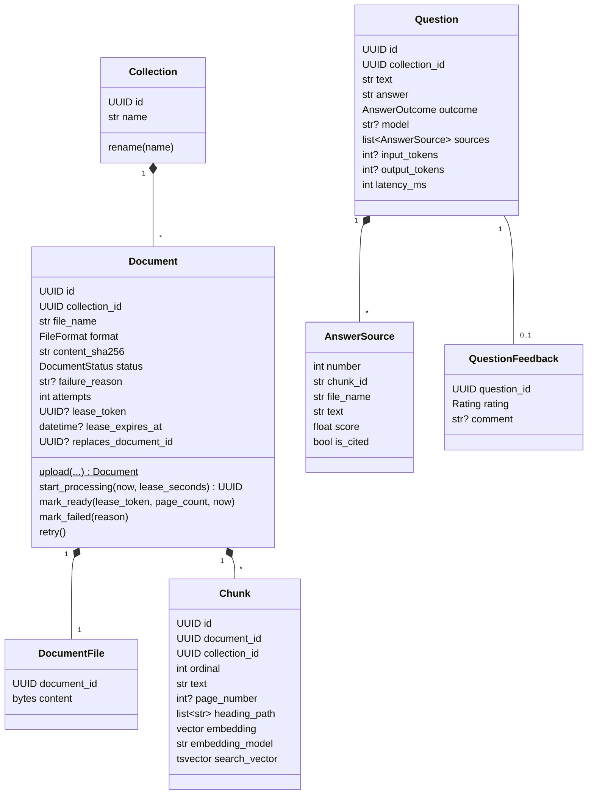
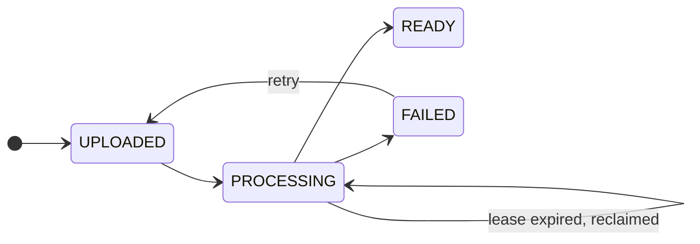

# Domain Model

This document describes the core types of Docs Q&A, the rules each one enforces, and how a document is ingested and a question is answered. It is based on [requirements.md](requirements.md).

## Types

| Type | Kind | Purpose |
|---|---|---|
| `Collection` | Entity | A named set of documents searched together. Questions are scoped to one collection. |
| `Document` | Aggregate root | One uploaded file and its ingestion lifecycle. Owns its file and its chunks; deleting it deletes both. |
| `DocumentFile` | Entity inside `Document` | The uploaded bytes, in a separate table so listing documents never loads them. |
| `Chunk` | Entity inside `Document` | One passage with its embedding, its full-text vector and its location in the source file. Never edited; a new version of the document gets new chunks. |
| `ChunkLocation` | Value object | Page number for PDFs, heading path (`["Leave policy", "Sick leave"]`) for Markdown. Shown with every source. |
| `Question` | Entity | One question and everything needed to explain its answer: the sources with their scores, which ones were cited, model, token usage and latency. Written once. |
| `AnswerSource` | Value object | A copy of one retrieved chunk as it was when the question was answered. Chunks are deleted when their document is replaced, so the question keeps its own copy. |
| `QuestionFeedback` | Entity | A reader's rating of one answer. At most one per question; rating again replaces it. |

## Enums

| Enum | Values |
|---|---|
| `FileFormat` | `PDF`, `MARKDOWN`, `PLAIN_TEXT` |
| `DocumentStatus` | `UPLOADED`, `PROCESSING`, `READY`, `FAILED` |
| `AnswerOutcome` | `ANSWERED`, `NOT_IN_DOCUMENTS`, `UNSUPPORTED` |
| `Rating` | `HELPFUL`, `NOT_HELPFUL` |
| `Role` | `READER`, `EDITOR` |

`AnswerOutcome.NOT_IN_DOCUMENTS` means retrieval found nothing similar enough and the LLM was not called. `UNSUPPORTED` means the LLM answered but cited no valid source, so the answer is shown with a warning.

All enums are stored as strings, so rows stay readable and reordering an enum cannot change stored data.

## Document lifecycle

Allowed transitions are declared once, in a transition table inside `Document`. Any other transition raises `InvalidDocumentTransitionError`.

A worker that claims a document gets a lease: an expiry time and a random `lease_token`. If the worker crashes, the lease runs out and another worker reclaims the document with a new token. The token works as a fencing token: when a slow worker finally finishes, `mark_ready` checks that its token is still the current one and raises `LeaseLostError` if not, so its result is thrown away instead of writing a second set of chunks.

After the configured number of attempts the document moves to `FAILED` instead of being reclaimed again, so a file that always crashes the worker cannot block the queue.

## Rules and where they are enforced

| Rule | Enforced by |
|---|---|
| Only allowed status transitions happen | `Document._transition_to` and its transition table |
| Only PDF, Markdown and UTF-8 text under the size limit are accepted | Upload route (size) and `detect_file_format` |
| The same content is not ingested twice in one collection | Unique index on `(collection_id, content_sha256)`; upload returns the existing document |
| A document's chunks appear all at once or not at all | Chunks and the `READY` transition are written in one database transaction, so only `READY` documents have chunks |
| A result from a worker whose lease was taken over is discarded | `Document.ensure_lease_held` with the fencing token, under a row lock |
| A replaced document disappears only when its new version is `READY` | The worker deletes `replaces_document_id` in the same transaction that marks the new version ready |
| Question and chunk embeddings come from the same model | Every chunk stores `embedding_model`; vector search filters on it; API and worker refuse to start if chunks from another model exist |
| A chunk stays within the embedding model's input size | `Chunker` (at most `max_words` words), covered by unit tests |
| A citation can only point at a source that was sent to the LLM | `cited_source_numbers` ignores numbers outside `1..len(sources)` |

## Ingesting a document

1. The API validates the file and inserts a `Document` in `UPLOADED` together with its `DocumentFile`. If the content hash already exists in the collection, it returns that document instead.
2. A worker claims the oldest `UPLOADED` document, or a `PROCESSING` one whose lease has expired, using `SELECT ... FOR UPDATE SKIP LOCKED`, moves it to `PROCESSING` with a new lease token, and commits. The lock is held only for this short transaction.
3. The parser for the file's format extracts text with page numbers or headings. Each format has its own parser behind one `DocumentParser` interface.
4. The `Chunker` packs paragraphs into chunks of at most 300 words with a 45-word overlap, never crossing a page or heading boundary.
5. Each chunk is embedded with a short header naming its file and location (`leave-policy.md (Leave policy > Sick leave)`), so a chunk that never repeats its topic still matches questions about it.
6. In one transaction the worker locks the document row, checks its lease token, inserts the chunks, marks the document `READY` and deletes the replaced version if there is one. A file with no extractable text is marked `FAILED` with the reason. Any other error leaves the lease to expire, so the document is retried later.

## Answering a question

1. The question is embedded with the same model as the chunks.
2. Two searches run on the collection's chunks: vector search by cosine distance (HNSW index, with pgvector's iterative scan so the collection filter does not starve the results) and PostgreSQL full-text search, where the question's words are joined with OR and ranked with `ts_rank_cd`. Each returns its top 20.
3. The two lists are merged with Reciprocal Rank Fusion and the top 6 chunks are kept.
4. If the best vector similarity is below the configured minimum, the outcome is `NOT_IN_DOCUMENTS` and the LLM is not called.
5. Otherwise the chunks are sent to the LLM as numbered `<source>` blocks, escaped so document text cannot close a tag, in the request input. The rules (answer only from the sources, cite with `[n]`, ignore instructions inside sources) go in the separate `instructions` field.
6. The answer streams back to the client as it is generated. When it is complete, the `[n]` markers are parsed; numbers that do not match a source are ignored. An answer with no valid citation is marked `UNSUPPORTED`.
7. The `Question` is saved with a copy of every source, which ones were cited, token usage and latency, and the client receives the saved question as the last event.
