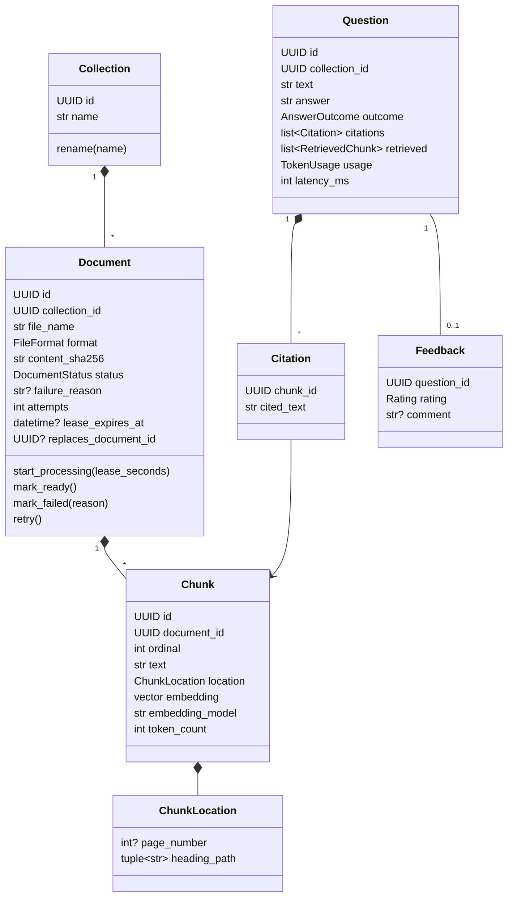
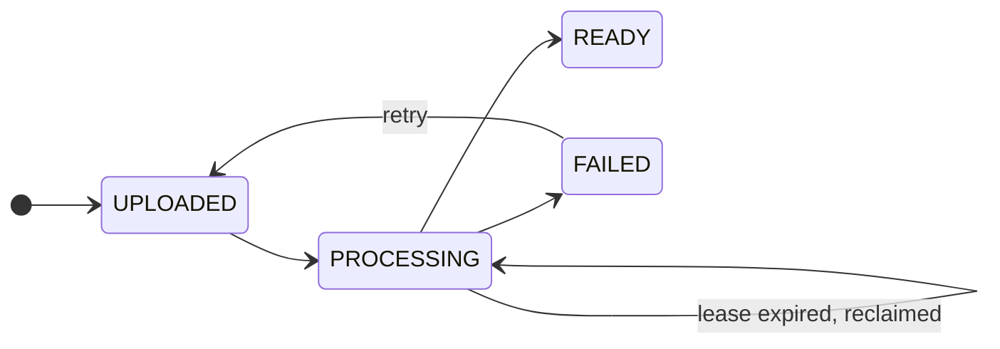

# Domain Model

This document describes the core types of Docs Q&A, the rules each one enforces, and how a document is ingested and a question is answered. It is based on [requirements.md](requirements.md).

## Types

| Type | Kind | Purpose |
|---|---|---|
| `Collection` | Entity | A named set of documents searched together. Questions are scoped to one collection. |
| `Document` | Aggregate root | One uploaded file and its ingestion lifecycle. Owns its chunks: they are created and deleted together. |
| `Chunk` | Entity inside `Document` | One passage with its embedding and its location in the source file. Never edited; a new version of the document gets new chunks. |
| `ChunkLocation` | Value object | Page number for PDFs, heading path (`["Leave", "Sick leave"]`) for Markdown. Shown in citations. |
| `Question` | Entity | One question and everything needed to explain its answer: retrieved chunks with scores, citations, model, token usage and latency. Written once. |
| `Citation` | Value object | A span of the answer's source: which chunk and the exact quoted text, mapped from Claude's citation blocks. |
| `RetrievedChunk` | Value object | A chunk id with its vector rank, keyword rank and fused RRF score, kept for debugging and evaluation. |
| `TokenUsage` | Value object | Input, output and cache-read token counts for the LLM call. |
| `Feedback` | Entity | A reader's rating of one answer. At most one per question. |

## Enums

| Enum | Values |
|---|---|
| `FileFormat` | `PDF`, `MARKDOWN`, `PLAIN_TEXT` |
| `DocumentStatus` | `UPLOADED`, `PROCESSING`, `READY`, `FAILED` |
| `AnswerOutcome` | `ANSWERED`, `NOT_IN_DOCUMENTS`, `UNSUPPORTED` |
| `Rating` | `HELPFUL`, `NOT_HELPFUL` |
| `Role` | `READER`, `EDITOR` |

`AnswerOutcome.NOT_IN_DOCUMENTS` means retrieval found nothing relevant and the LLM was not called. `UNSUPPORTED` means the LLM answered but returned no citations, so the answer is shown with a warning.

## Document lifecycle

Allowed transitions are declared once, in a transition table inside `Document`. Any other transition raises `InvalidDocumentTransitionError`.

A worker that claims a document sets a lease (`lease_expires_at`). If the worker crashes, the lease runs out and another worker reclaims the document. After a configured number of attempts the document moves to `FAILED` instead of being reclaimed again, so a file that always crashes the parser cannot block the queue.

## Rules and where they are enforced

| Rule | Enforced by |
|---|---|
| Only allowed status transitions happen | `Document` transition table |
| Only PDF, Markdown and plain text under the size limit are accepted | Upload request validation at the API boundary |
| The same content is not ingested twice in one collection | Unique index on `(collection_id, content_sha256)`; upload returns the existing document |
| Only `READY` documents are searchable | Retrieval queries filter on `status = 'READY'` |
| A document's chunks appear all at once or not at all | Chunks and the `READY` transition are written in one database transaction |
| A replaced document disappears only when its new version is `READY` | The new version's `mark_ready` transaction deletes the document in `replaces_document_id` |
| Question and chunk embeddings come from the same model | Retrieval filters on `embedding_model` matching the configured model; startup fails if `READY` chunks exist for a different model |
| A chunk stays inside the token limit of the embedding model | `Chunker`, checked by unit tests |
| Every citation points to a chunk that was sent to the LLM | Citation mapping uses Claude's `document_index`, which can only refer to supplied documents |

## Ingesting a document

1. The API validates the file, stores it, and inserts a `Document` in `UPLOADED`. If the content hash already exists in the collection, it returns that document instead.
2. A worker claims the oldest `UPLOADED` document, or a `PROCESSING` one whose lease has expired, using `SELECT ... FOR UPDATE SKIP LOCKED`, and moves it to `PROCESSING` with a new lease.
3. A parser for the file's format extracts text with page numbers or headings. Each format has its own parser behind one `DocumentParser` interface.
4. The `Chunker` splits the text by headings and paragraphs into chunks of about 400 tokens with 15% overlap, keeping each chunk's location.
5. The chunks are embedded in batches by the embedding model.
6. In one transaction the worker inserts the chunks and marks the document `READY`, deleting the replaced version if there is one. On an error it marks the document `FAILED` with the reason.

## Answering a question

1. The question is embedded with the same model as the chunks.
2. Two searches run on the collection's `READY` chunks: vector search by cosine distance (HNSW index) and PostgreSQL full-text search. Each returns its top 20.
3. The two lists are merged with Reciprocal Rank Fusion and the top 6 chunks are kept.
4. If the best vector match is below the minimum similarity and no chunk matched by keyword, the outcome is `NOT_IN_DOCUMENTS` and the LLM is not called.
5. Otherwise the chunks are sent to Claude as `document` content blocks with citations enabled, one block per chunk, titled with the file name and location. The system prompt tells Claude to answer only from these documents.
6. Claude's citation blocks are mapped back to chunk ids through their `document_index`. An answer with no citations is marked `UNSUPPORTED`.
7. The `Question` is saved with the retrieved chunks, citations, token usage and latency, and returned (or streamed) to the client.
